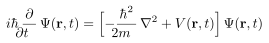

# VecTeX

[](https://github.com/maiani/vectex/actions/workflows/test.yml)
[](https://pypi.org/project/vectex/)
[](https://www.python.org/)
[](LICENSE)

VecTeX compiles TeX source into one self-contained SVG `<g>` fragment, so
equations and labels in a figure are generated from code and stay editable
afterwards. Output is deterministic, with stable ids, so a figure can be
regenerated and diffed in version control; the fragment is also an editable
TexText object once inserted into an Inkscape document.

<p align="center">
  
</p>

<p align="center"><sub>One display equation, compiled by real TeX into an SVG fragment, from <code>docs/readme_figure.py</code>.</sub></p>

VecTeX is a library-level reimplementation of the rendering and normalization
boundary behind TexText. It needs neither Inkscape nor access to the
destination document.

## Install

VecTeX is on PyPI and needs Python 3.12 or newer:

```bash
python -m pip install vectex
```

Rendering also needs a TeX engine (`pdflatex`, `xelatex`, or `lualatex`) and
`dvisvgm` on `PATH`; TeX Live and MiKTeX ship both. The optional object-model
adapters install with an extra:

```bash
python -m pip install 'vectex[svg-py]'   # import svg
python -m pip install 'vectex[drawsvg]'  # import drawsvg
python -m pip install 'vectex[all]'
```

## Quick start

```python
import vectex

fragment = vectex.render(r"mass $m$ and energy $E = mc^2$")
label = vectex.render(r"$E = mc^2$", size_pt=8, id_prefix="einstein")
vector = vectex.render(r"$\bm{n}$", extra_packages=("bm",))
purple = vectex.render(r"$\mu$", color="#7a1fa2")  # glyphs and rules alike

svg_text = fragment.to_svg()  # the <g> fragment as a string
lxml_group = fragment.to_lxml()  # a fresh lxml element
document = fragment.to_svg_document()  # a complete, openable SVG document
fragment.write_svg_document("label.svg")  # the same document, on disk

print(fragment.width, fragment.height, fragment.view_box)
print(fragment.source, fragment.engine, fragment.metadata)
```

The outer group of `label` has `id="einstein-root"`, and rendering the same
input again produces the same bytes.

TeX input is always a literal document body, the convention TexText uses:
`$...$` marks inline mathematics, `\[...\]` display mathematics, and everything
else is prose. Complete environments such as `align*` work directly. `amsmath`
is loaded by default, so `\text{...}` works in math.

The default template is a zero-border `standalone` page cropped to each
fragment. `extra_packages=("bm",)` adds `\usepackage` lines; a nonempty
`preamble` replaces the whole preamble and must contain `\documentclass`
(`preamble=r"\documentclass{article}"` restores full-page geometry). The two
options are mutually exclusive.

Size with `size_pt=7` for a target font size, or the lower-level `scale=0.7`;
passing both is an error. TeX sizing is resolved against the document class
(10 pt by default).

Every call uses a fresh temporary directory and runs two stages:

```text
source -> pdflatex/xelatex/lualatex -> PDF -> dvisvgm -> SVG -> lxml -> <g>
```

## Command line

The `vectex` command renders a document body to a fragment on standard output:

```bash
vectex '$E = mc^2$'
vectex '$E = mc^2$' --as-doc > einstein.svg      # a complete SVG document
vectex '$E = mc^2$' --as-doc -o einstein.svg     # or write it with -o/--output
vectex --input equation.tex --as-doc -o equation.svg
printf '%s\n' '$E = mc^2$' | vectex - --as-doc > einstein.svg
```

`--extra-package NAME` (repeatable) loads a package; `--preamble` or
`--preamble-file preamble.tex` supplies a complete preamble, and the file form
also records its absolute path for later TexText editing. `--cache-dir PATH`
reuses render records, and `--refresh` recompiles the selected one.
`--id-prefix`, `--size-pt`, `--engine`, and `--executable NAME=PATH` mirror the
Python options. `vectex --help` lists everything; `vectex --version` reports the
installed version.

## TikZ pictures

A `tikzpicture` is an ordinary document body:

```python
arrow = vectex.render(
    r"\begin{tikzpicture}\draw[->] (0,0) -- (2,1);\end{tikzpicture}",
    extra_packages=["tikz"],
)
```

`extra_packages` emits only `\usepackage` lines, so `\usetikzlibrary`,
`\pgfplotsset`, and package options need a complete `preamble`.
[`examples/bloch_sphere.py`](examples/bloch_sphere.py) is a worked example, and
[`examples/figure_labels.py`](examples/figure_labels.py) renders a batch of
labels in one compilation. The
[rendering guide](docs/rendering.md#tikz-pictures) records one converter
limitation: `dvisvgm` does not translate PDF shadings, so `\shade` and
`ball color` yield a correctly sized fragment with nothing painted in it. Flat
fills, patterns, opacity, and `pgfplots` convert normally.

## Embedding and adapters

`to_lxml()` returns a fresh element on every call, so editing it cannot mutate
the fragment's canonical serialization:

```python
from lxml import etree

document = etree.fromstring('<svg xmlns="http://www.w3.org/2000/svg"/>')
document.append(fragment.to_lxml())
```

The optional adapters wrap the complete normalized XML rather than translating
arbitrary SVG into a smaller object model:

```python
import drawsvg
import svg

svg_py_document = svg.SVG(
    width=fragment.width_px,
    height=fragment.height_px,
    elements=[fragment.to_svg_py()],
)

drawing = drawsvg.Drawing(fragment.width_px, fragment.height_px)
drawing.append(fragment.to_drawsvg())
```

Both documents measure in CSS px, so the wrappers scale the label from TeX
points to px and it keeps its size; `width_px`, `height_px`, and `baseline_px`
measure it there, and `unit="pt"` gives the canonical group unscaled.

## TexText editing in Inkscape

TexText recognizes editable nodes by attributes in its namespace on the outer
`<g>`. VecTeX writes the current compatibility fields: encoded source, compiler,
converter marker, preamble-file path, scale, alignment, version, and transform
Jacobian. Insert the outer group itself and select that whole group before
opening TexText; TexText rejects a selected nested path or subgroup. Because
both tools treat the stored text as a document body, it recompiles without
translation.

TexText stores its preamble as a file path, while VecTeX accepts preamble
content. If re-editing must use the same custom preamble, pass both:

```python
fragment = vectex.render(
    r"$\operatorname{rank}(A)$",
    preamble="\\documentclass{standalone}\n\\usepackage{amsmath}",
    textext_preamble_file="/absolute/shared/preamble.tex",
)
```

The path must be accessible to TexText on the editing machine; the preamble
content itself is kept in VecTeX metadata. Pass `textext_compatible=False` to
omit all TexText attributes.

## Executable discovery and configuration

Built-in components resolve `pdflatex`, `xelatex`, `lualatex`, and `dvisvgm`
with `shutil.which`. Exact overrides make discovery explicit:

```python
fragment = vectex.render(
    "$x+y$",
    executable_overrides={
        "pdflatex": "/opt/texlive/bin/pdflatex",
        "dvisvgm": "/opt/texlive/bin/dvisvgm",
    },
    timeout=20,
    compiler_args=("--synctex=0",),
    converter_args=("--precision=6",),
)
```

Argument options are sequences, never shell strings, and VecTeX never uses
`shell=True`. Nonzero exits and timeouts raise `CompilationError` or
`ConversionError` carrying argv, return code, stdout, and stderr. Applications
may implement the `Compiler` and `Converter` protocols and pass component
objects instead of built-in names.

## Batch rendering and disk cache

`render_many([a, b, ...])` shares one compiler and one `dvisvgm` invocation
while preserving each expression's crop and baseline. A source may also be a
`RenderItem` carrying any option that shapes its fragment; options left as
`None` take the batch value. Items that can share a compilation are grouped, so
labels differing only in size still cost one invocation, while an item with its
own preamble or engine forms its own group. Fragments come back in input order.
`render()` also accepts a `RenderItem`.

The persistent cache is enabled with `cache_dir=` or `VECTEX_CACHE_DIR`. Entries
are keyed by every output-driving option and by the identity of the installed
tools (resolved path and reported version for built-in components, or a
component's own `identity()`), so records are not reused across a TeX or
`dvisvgm` upgrade. Entries are checksummed and written atomically, and corrupt
ones are treated as misses. `refresh=True` recompiles one record, and
`vectex.clear_cache(directory)` removes only Vectex's records and returns how
many it removed.

## Fragment guarantees

A successful render returns exactly one SVG `<g>` root with:

- copied converter definitions and visible elements;
- a deterministic, input-derived id prefix, with `href`, `xlink:href`, and
  `url(#...)` references rewritten, including inside inline styles;
- the source viewport represented by an inner matrix transform;
- normalized width, height, view box, scale, and measurable baseline;
- TeX's default black, in fills and strokes, as `currentColor`, so a label
  takes the CSS `color` of where it is placed -- or `color=` at render time --
  rules included, while parts coloured in TeX keep their colour;
- deterministic repeated serialization;
- a VecTeX `<metadata>` child with format version, source, engine, converter,
  geometry, and preamble/options;
- TexText edit attributes unless disabled.

Identical render inputs serialize identically, and changed output-driving
inputs get a different namespace. `id_prefix="einstein"` names the outer group
`einstein-root` and rewritten definitions `einstein-0`, …; the CLI spells it
`--id-prefix einstein`. `render_many(..., id_prefix="labels")` suffixes the
prefix by input position. Use `unique_ids=True` when embedding the same render
more than once in one SVG.

## Security and trust assumptions

The XML parser disables DTD loading, entity resolution, network access,
recovery, comments, and processing instructions. Normalization rejects scripts,
`foreignObject`, SVG animation, event handlers, `<style>` elements, CSS imports,
external hrefs and URLs, duplicate ids, and unresolved local references, so a
fragment carries no active content and no dependency on destination CSS.

LaTeX is a powerful program, not a sandbox. VecTeX passes `-no-shell-escape` to
the built-in engines, but a malicious source or compiler option can still read
files or consume resources. Compile only trusted source, and use an OS or
container sandbox for untrusted input. Executable overrides, preamble content,
and extra argv values are trusted configuration.

## Stability and supported platforms

VecTeX is beta. The API is settled enough to build on, and what may still change
is written down here rather than discovered in a release.

**Public API.** The supported surface is the names in `vectex.__all__` and the
`vectex` command-line interface. Module layout, private helpers, and the shape
of intermediate records may change in any release. The package ships a
`py.typed` marker, so consumers type-check against that surface.

**Versioning.** VecTeX follows [Semantic Versioning](https://semver.org/spec/v2.0.0.html).
Before 1.0 a minor release may still break the public API, but never silently:
every break is listed under `Changed` or `Removed` in
[`CHANGELOG.md`](CHANGELOG.md). Patch releases never break it. 1.0 will freeze
the surface above for the 1.x series.

**Output stability** is a separate and stronger promise: identical render inputs
serialize identically (see [Fragment guarantees](#fragment-guarantees)). Treat a
change in bytes for unchanged inputs as a bug.

**Supported platforms.** VecTeX is pure Python driving an external TeX
toolchain, so support is bounded by what continuous integration exercises:

| | Python | Unit tests | Real TeX toolchain |
| --- | --- | --- | --- |
| Linux | 3.12 and 3.14 | yes | yes (Python 3.14): pdflatex, xelatex, lualatex, dvisvgm |
| macOS | 3.14 | yes | not exercised |
| Windows | 3.14 | yes | not exercised |

Python 3.13 is not built separately, on the assumption that a pure-Python
package passing at both ends of its range passes between them. On macOS and
Windows the unit suite covers executable lookup and path handling, but no job
installs TeX: rendering is expected to work with TeX on `PATH` and is not
verified by CI. Report a platform failure as a bug; the gap is in the testing,
not the intent.

## Development

Unit tests use checked-in SVG fixtures and mocked subprocesses, and need no TeX
installation:

```bash
uv sync --all-extras
uv run ruff format --check .
uv run ruff check .
uv run ty check
uv run pytest
uv run python -m build
```

The real-tool tests are opt-in locally because they need TeX. They include
`tests/test_examples.py`, which runs every script in `examples/`:

```bash
VECTEX_RUN_INTEGRATION=1 uv run pytest -m integration
uv run python examples/bloch_sphere.py --theta 50 --phi 40
```

Continuous integration runs the real-tool tests against TeX Live on every push,
every release, and nightly. That job first checks that each executable is
present, because the tests skip themselves when a tool is missing and a silent
skip would look like a pass.

## Related projects

VecTeX is developed alongside [FigWorks](https://github.com/maiani/figworks),
which composes multi-panel figures, and two other producers of editable SVG:
[VecView](https://github.com/maiani/vecview) (layered 3D schematics) and
[VecWire](https://github.com/maiani/vecwire) (circuit schematics). All four share one premise: figures generated from code,
with stable ids and byte-identical output, that stay editable in Inkscape.

VecTeX does not depend on any of them. A composition tool needs only
`VectexFragment.to_svg_document()`, so the integration costs no import in either
direction, and VecTeX works the same against any destination that accepts SVG.

## Documentation

- [Rendering](docs/rendering.md): the pipeline, baselines, TexText contract, and
  trust policy
- [Fragments](docs/fragments.md): placement, anchors, and caller integration
- [Development](docs/development.md): toolchain and releases

Build the site locally with `uv run zensical build`.

## License

MIT
